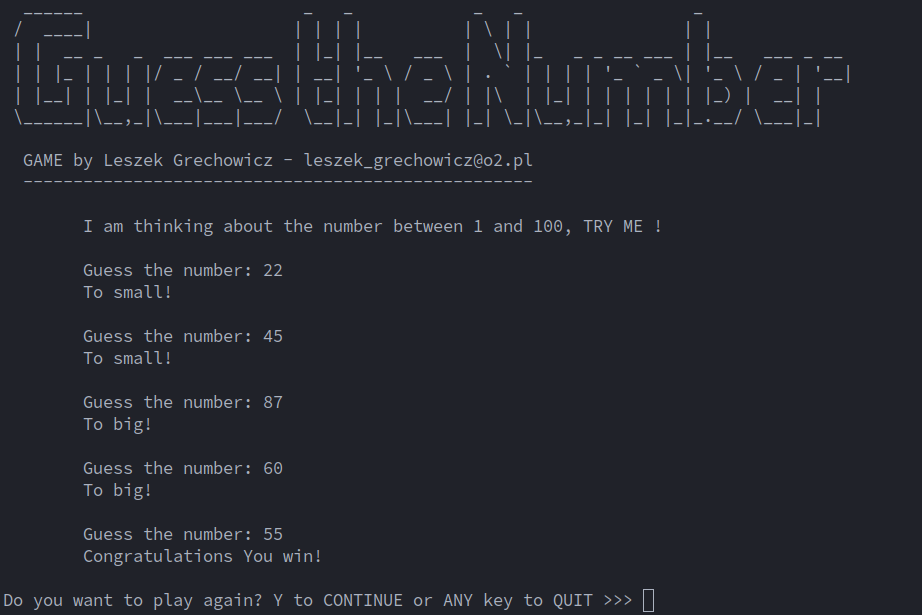

# Guess-the-Number--Game

Python implemented, terminal/command-line interactive game that requires to find a number based on greater than or less than feedback.

 

 
## How to run:

> **Note**: to run this game you have to have Python installed on your machine.

Clone the repository

* **SSH**
```sh
git clone git@github.com:leszekgrechowicz/Guess-the-Number--Game.git
```
* **HTTPS**
```
git clone https://github.com/leszekgrechowicz/Guess-the-Number--Game.git
```

**To run the game simply go to the directory and use Python as follows:**
```
$ cd Guess-the-Number--Game
```
for Linux/Ubuntu
```
~/Guess-the-Number--Game$ python3 guess_the_number.py
```
for Windows:

```
python guess_the_number.py
```
## Usage:

Try to guess the number and follow the clues :) 

